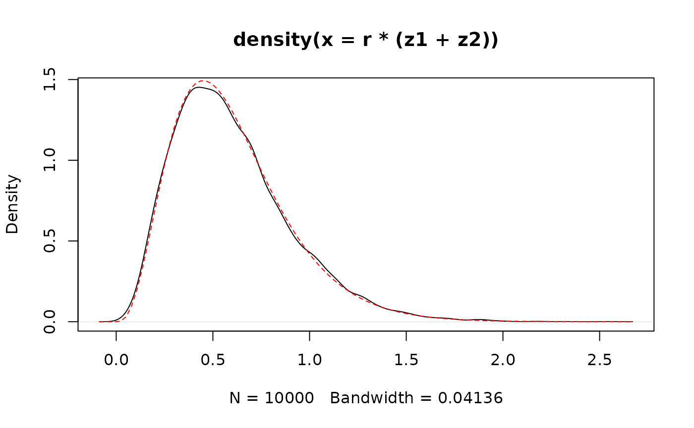
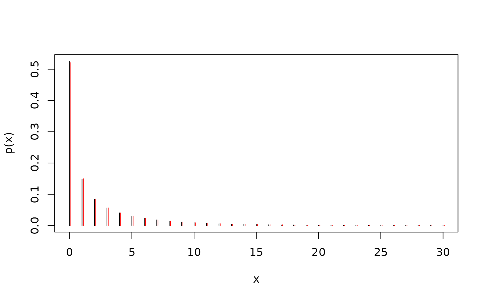

# Parametrization of the negative binomial and gamma distribution

The negative binomial distribution describes the probability of seeing a
given number of failtures failures before obtaining $`r`$ successes in
iid Bernoulli trials with probability parameter $`p`$. More generally,
let $`X\sim
\operatorname{NB}(r, p)`$ for real parameters $`r>0`$, $`p\in(0,1)`$,
then $`X`$ has distribution given by
``` math
\begin{align*}
\mathbb{P}(X=x) = \frac{\Gamma(r+x)}{k!\Gamma(r)}(1-p)^x p^r, x\in\mathbb{N}_0.
\end{align*}
```
The [`stats::rbinom`](https://rdrr.io/r/stats/Binomial.html) function
uses this parametrization, and we have
``` math
\begin{align*}
\mathbb{E}X = r(1-p)p^{-1}, \quad
\mathbb{V}\!\!\operatorname{ar}(X) = r(1-p)p^{-2}.
\end{align*}
```
Further, if $`X_1\sim\operatorname{NB}(r_{1}, p)`$ and
$`X_2\sim\operatorname{NB}(r_{2}, p)`$ are independent then
$`X_1+X_2\sim\operatorname{NB}(r_{1}+r_{2}, p)`$.

To simulate from a negative binomial distribution with specific mean and
variance we can use the
[`carts::rnb`](https://novonordisk-opensource.github.io/carts/reference/rnb.md)
function

``` r

x <- carts::rnb(1e4, mean = 1, variance = 2)
c(mean(x), var(x))
```

    ## [1] 0.98320 1.92371

The negative binomial distribution can also be constructed as a
gamma-poisson mixture. We write $`Z\sim\Gamma(\alpha, \beta)`$ when
$`Z`$ is gamma-distributed with *shape* $`\alpha>0`$ and *rate*
parameter $`\beta>0`$, and the density function is given by
``` math
\begin{align*} f(z) =
\frac{\beta^\alpha}{\Gamma(\alpha)}z^{\alpha-1}\exp(-\beta z), \quad z>0.
\end{align*}
```

This parametrization leads to
``` math
\begin{align*}
\mathbb{E}Z= \alpha\beta^{-1}, \quad \mathbb{V}\!\!\operatorname{ar}(Z) = \alpha\beta^{-2}.
\end{align*}
```

We will exploit that the gamma distribution is closed under both
convolution and scaling. Let $`Z_{1}\sim\Gamma(\alpha_{1}, \beta)`$ and
$`Z_{2}\sim\Gamma(\alpha_{2}, \beta)`$ be independent and $`\lambda>0`$
then
``` math
\begin{align*}
Z_1 + Z_2 \sim \Gamma(\alpha_1+\alpha_2, \beta), \quad
\lambda Z_1 \sim \Gamma(\alpha_1, \lambda^{-1}\beta).
\end{align*}
```

``` r

b <- 2
a1 <- 1
a2 <- 3
r <- 0.3
n <- 1e4
## Shape-rate parametrization
z1 <- rgamma(n, a1, b)
z2 <- rgamma(n, a2, b)
## r(z1+z2) ~  gamma(a1+a2, b/r)
plot(density(r * (z1 + z2)))
curve(dgamma(x, a1 + a2, b / r), add = TRUE, col = "red", lty = 2)
```



The negative binomial distribution now appears as the gamma-poisson
mixture in the following way. If we let
$`X\mid\lambda\sim\operatorname{Pois}(\lambda)`$ with stochastic rate
$`\lambda\sim\Gamma(\alpha, \beta)`$, then
$`X\sim\operatorname{NB}(\alpha, \beta(1+\beta)^{-1})`$.

Consider now $`Z\sim\Gamma(\nu, \nu)`$, hence $`\mathbb{E}Z=1`$ and
$`\mathbb{V}\!\!\operatorname{ar}(Z)=\nu^{-1}`$, and let
$`Y\mid Z\sim\operatorname{Pois}(\lambda_{0}Z)`$ for some fixed
$`\lambda_0>0`$, then direct calculations shows that
$`Y\sim\operatorname{NB}(\nu, \nu(\nu + \lambda_{0})^{-1})`$ and
``` math
\begin{align*}
\mathbb{E}Y = \lambda_0, \quad
\mathbb{V}\!\!\operatorname{ar}(Y) = \lambda_0^2\nu^{-1} + \lambda_0.
\end{align*}
```

``` r

z <- carts::rnb(1e5,
  mean = 2,
  gamma.variance = 3
)
c(mean(z), var(z))
```

    ## [1]  2.00573 14.21768

``` r

x <- seq(0, 30)
mf <- function(y, x) sapply(x, function(x) mean(y == x))
plot(x, mf(z, x), type = "h", ylab = "p(x)")
y <- rpois(length(z), 2 * rgamma(length(z), 1 / 3, 1 / 3))
lines(x + 0.1, mf(y, x), type = "h", col = "red")
```



## Bibliography
